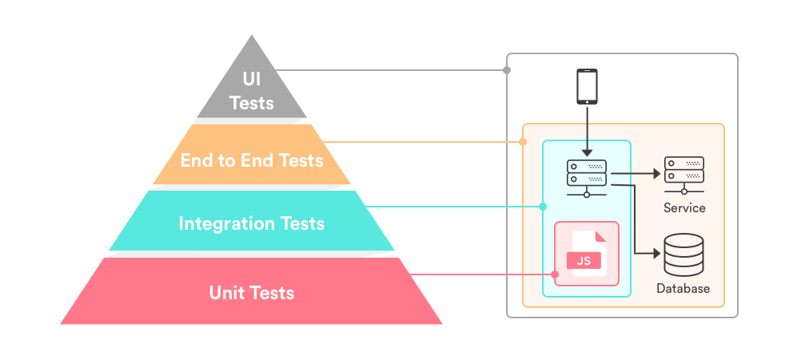

# Testing en backend

## Diagrama de tests

### UI Tests (Capa Gris)
> Estos tests no son relevantes aquí.
> Usa **Playwright**

### End-to-End Tests (Capa Naranja):
* Aplica a Catalog.API. 
* Prueba el flujo completo desde los endpoints hasta el dominio y datos.
* Usa **xUnit** o **REST client libraries** (como **HttpClient** en pruebas funcionales).

### Integration Tests (Capa Celeste):
* Aplica a las capas de Infrastructure y Application.
* Prueba interacción con bases de datos, servicios externos y repositorios.
* Usa **xUnit** con **TestServer** (de Microsoft.AspNetCore.Mvc.Testing) para probar servicios y bases de datos.

### Unit Tests (Capa Roja):
* Aplican a las capas de Domain y Application.
* Prueba lógica de dominio y reglas de negocio.
* Usa **xUnit** o **NUnit** con **Moq** para mocks de dependencias.